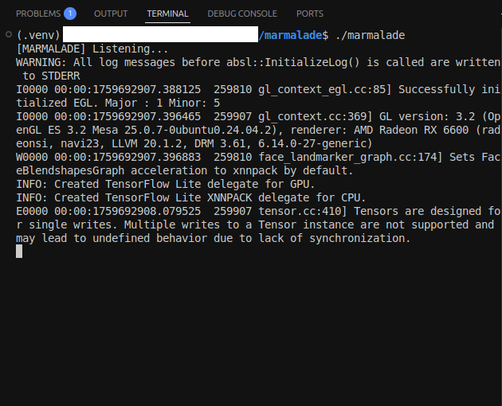
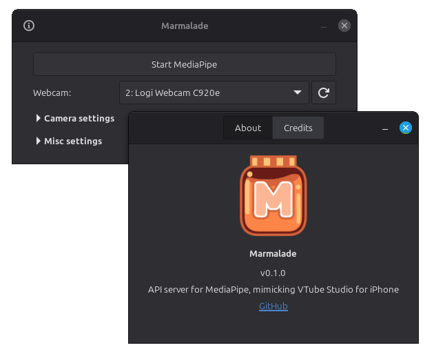

# Marmalade

 

Allows VTuber applications running on Linux, such as VBridger and VSeeFace, to use MediaPipe externally.

| Command-line | GTK 4 (GUI) |
| ---- | ---- |
|  |  |

Also available under GTK 3 (GUI).

## Installing

1. Download the [latest release](https://github.com/RanAwaySuccessfully/marmalade/releases/latest) of Marmalade.
2. Download the latest [`face_landmarker.task`](https://ai.google.dev/edge/mediapipe/solutions/vision/face_landmarker) file from Google's MediaPipe page and place it anywhere in the main folder, or create a folder for it if you wish.
3. Install `ffmpeg`¹ (>=4.3) or its individual components². It's likely already installed.
4. If using any of the GUI versions, you'll also need to have the following installed, although they are probably already installed by default:
    - `libgtk-3`¹ or `gtk3`¹ (>=3.24, only if using GTK 3)
    - `libgtk-4`¹ or `gtk4`¹ (>=4.8, only if using GTK 4)
    - `libv4l`¹
    - `xdg-utils`
    - `pciutils`

¹ May be suffixed by another version number, for example: `libgtk-3-0t64`, `libgtk-4-1`, `libv4l-0`.

² Technically speaking you only need `libavcodec`, `libavutil` and `libswscale`.

And you're done. You can just run the program at any time, and it should take care of the rest for you.

### First-time setup

- If using a GUI version, and it notices its icon is not installed, it will install a local copy to distinguish it between just a random executable. If you wish to uninstall the icon, run the command-line version of Marmalade like so: `./marmalade -u`.

## Connecting

Unless you have a very specific use case, **do not change the default port numbers** on either Marmalade or the apps you want to connect to it. The defaults *should* work just fine.

If you're running Marmalade on the same PC as the program you want to connect to, then you can use the IP address `127.0.0.1`, which is the loopback IP (always points to your own PC).

If you're running it on another machine over LAN, you'll need to figure out its IP address and to make sure it is reachable via UDP port that Marmalade is configured to use (see "Config file" section below).

If you need more specific instructions, see [this document](/docs/connecting.md).

### Supported connections

You can choose to connect apps to Marmalade in a few different ways, as long as the app supports the same protocols as Marmalade.

**VBridger**, **VNyan** and **VSeeFace** all support both **VTS 3rd Party API** and **VMC Protocol**.

**Warudo** only supports **VMC Protocol**.

Connecting directly to **VTube Studio** without using any of the apps above requires using the **VTS Plugin** option.

Hand tracking is not available when using **VTS 3rd Party API**, but is available using the other protocols.

## Config file

**If using a GUI version, you do not need to worry about this file** unless it becomes corrupted somehow, as the UI allows you to edit it seamlessly. If using the command line version, you'll need to edit it manually to use the settings that you want. It is located right beside the app's executable as `config.json`.

Here's what each field in this file is responsible for:

* port: The UDP port that Marmalade will be listening to. If you don't know what to do with this, keep the default value of `21412`.
* camera: Camera ID (index). Starts at `0` and goes up from there.
* width: Camera horizontal resolution (number of pixels).
* height: Camera vertical resolution (number of pixels).
* fps: Camera frames per second.
* format: Camera format. Examples: `"YUYV"`, `"MJPG"`, etc...
* model: Filename of the model file that MediaPipe will use for face tracking.
* use_gpu: Set to `true` to attempt to use the GPU for processing MediaPipe, and leave it at `false` otherwise.
* prime_id: PCIe bus (slot/address) of the GPU that should be used by MediaPipe.* An empty string is valid, in which case, the default GPU will be used. Has no effect if `use_gpu` is `false`.

The fields `model` and `prime_id` are string values, and as such they're surrounded by `"` (double quotes) unlike other fields.

* This is the same as the `DRI_PRIME` environment variable, and any valid value for it is also valid for this field, although the GUI versions only expects PCIe bus IDs and may glitch otherwise.

## Building, Testing, Debugging

**You do not need to do any of this to install Marmalade. See the "Installing" section above instead.**

If you want to develop or tinker with this program, you'll need to install the [Go programming language](https://go.dev/).

Marmalade is divided between the following apps:
- `cmd`
- `gtk3`
- `gtk4`
- `mediapipe`

For running one of these directly, run: `go run -v ./app/cmd`

For building an executable, run: `go build -v ./app/cmd`

If building the MediaPipe sub-process, see the section "MediaPipe" below.

Note that this will generate an executable in the folder typed out above, which you should copy the main folder of the repository (the top-most folder). You can tell it to build an executable with a different name, but you can also rename it by adding `-o custom_name_here` to the command. Note that Marmalade expects the `mediapipe` executable to have that exact name.

Depending on which executable you're building, you'll also need some extra development files installed:
- gtk3: `libv4l-dev gobject-introspection libgtk-3-dev`
- gtk4: `libv4l-dev gobject-introspection libgtk-4-dev`
- mediapipe: `libv4l-dev libavcodec-dev libavutil-dev libswscale-dev`

If you want to debug it, it comes with some Visual Studio Code configuration depending on what you want to debug:

- If you want to debug the command-line version, run `Go: Debug CMD`.
- If you want to debug the GTK 3 or GTK 4 version, run `Go: Debug GTK 3 Build` or `Go: Debug GTK 4 Build`. Note that this one will pre-build a `marmalade-gtk3` or `marmalade-gtk4` executable (so you can see each step of the build process).
- If you want to debug the MediaPipe sub-process, run `Go: Debug MediaPipe`.

### MediaPipe

Before building the mediapipe sub-process, you'll need to build or download a copy of `libmediapipe.so` and `libtoast.so`.

While the most recent stable release of MediaPipe is `v0.10.26`, if you clone the MediaPipe GitHub repository at specific commits you can grab in-development versions such as `v0.10.32`. These recent versions contain a C library that programs like Marmalade can use directly via **libmediapipe**. Unfortunately, the C API still has some trace amounts of C++ in it, which makes it impossible for Go to connect to it directly, so I created a wrapper called **libtoast** written in C but compiled as C++. In the future, I assume the C API will stabilize and **libtoast** will be removed, but for now this is a necessary component of Marmalade.

For compiling **libmediapipe**, a Git submodule is available at `app/mediapipe/cc/mediapipe` containing a fork of the MediaPipe version currently used by Marmalade, alongside a few extra patches I made for compatibility. If it's not already downloaded, you can download it by running `git submodule update --init --recursive`. Once you have downloaded the repo, please take a look at the [MediaPipe docs](https://ai.google.dev/edge/mediapipe/framework/getting_started/install) as well as the [Bazel command-line arguments](https://bazel.build/reference/command-line-reference) for more information on how to build MediaPipe. The only target you need to build is `//mediapipe/tasks/c:libmediapipe.so`.

I have provided [bazel-build.sh](/app/mediapipe/cc/bazel-build.sh) as an example but I provide no guarantees that it will work for you. Once you have compiled MediaPipe, the file `libmediapipe.so` will have been created inside MediaPipe submodule in the folder `bazel-bin/mediapipe/tasks/c/`. Copy that file to Marmalade's `cc` folder (the same folder that contains the file `libtoast.cc`).

You can compile **libtoast** by running [build.sh](/app/mediapipe/cc/build.sh) on while your working directory (current folder) is the `cc` folder. This will generate `libtoast.so`. This will fail if `libmediapipe.so` is not found. This requires GCC (specifically, the `g++` command) to be installed on your system.

### Build times

The GUI version of this project takes about 10 minutes to compile when building via GitHub Actions (probably faster on your PC), most of this time is taken up by building GTK and its dependencies. This will happen when building the program for the first time, but if you're using VSCode with the Go extension, it will also happen the first time you open a .go file in this project as VSCode will get busy generating all the IntelliSense data it needs.

Go has a caching mechanism that makes it so you don't have to go through this every time, but the cache does not last forever, so don't be surprised if you see it recompiling the GTK dependencies again. If you compile the GTK4 version, the GTK3 version will take slightly less time and vice-versa.

## License and Credits

Licensed under the [MIT License](LICENSE).

This project uses [gotk4](https://github.com/diamondburned/gotk4), which provides [GTK4](https://docs.gtk.org/gtk4/) and [GTK3](https://docs.gtk.org/gtk3/) language bindings for Go. This project does **not** use libadwaita.

This project used to have Python code that was modified from [lilacGalaxy's VTS Plugin](https://github.com/lilac-galaxy/lilacs-mediapipe-forward-vts-plugin).

Somewhat inspired by [Facetracker](https://codeberg.org/ZRayEntertainment/Facetracker) which uses OpenSeeFace instead.

Many thanks to Kylo-Neko's [Linux Guide to Vtubing](https://codeberg.org/KyloNeko/Linux-Guide-to-Vtubing) which is what kickstarted my adventuring into seeing if/how I can make this work.
