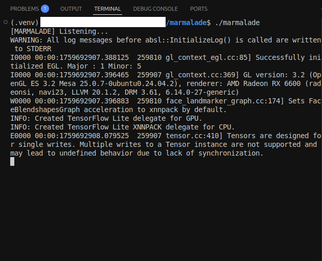
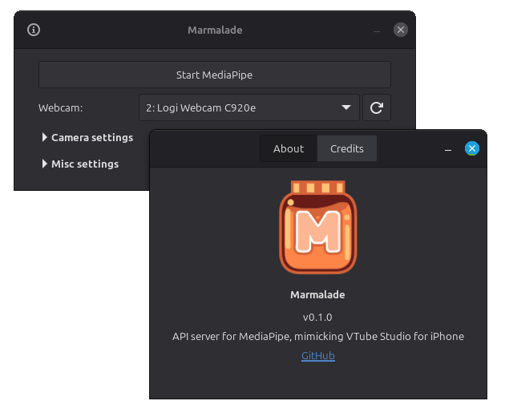

# Marmalade

Allows MediaPipe to be used on Linux by mimicking VTube Studio's iPhone Raw Tracking data. You can connect it to programs such as VBridger.

| Command-line | GTK 4 (GUI) |
| ---- | ---- |
|  |  |

## Installing

1. Download the latest release of Marmalade.
2. Download the latest [`face_landmarker.task`](https://ai.google.dev/edge/mediapipe/solutions/vision/face_landmarker) from Google's MediaPipe page and place it inside the `python` folder.
3. Install `python3`, `python3-venv` and `pip3`.
4. If using the GTK 4 (GUI) version, you'll also need to have `gtk-4` and `libv4l-0`¹ installed.

<small>¹ Might already be installed as it is a Linux Kernel API/library.</small>

And you're done. You can just run the program at any time, and it'll take care of the rest for you.

Note: On startup, if Marmalade does not find a `.venv` hidden folder when starting up, it will ask you if it should create one for you. This will install MediaPipe, which uses around 850MB of disk space. This will fail if you haven't done Step 3. If the `.venv` folder becomes corrupted, you can just delete it and have the program create it for you again. If you want to run this step manually, you can run `scripts/mediapipe-install.sh` and it expects your working directory (current folder) to be `scripts`.

## Config File

If using the GTK 4 (GUI) version, you do not need to worry about this file unless it becomes corrupted somehow, as the UI allows you to edit it seamlessly, and it is automatically saved when you hit the "Start MediaPipe" button (Stop does not count). If using the command line version, you'll need to edit it manually to use the settings that you want. it is located right beside the app's executable as `config.json`.

Here's what each field in this file is responsible for:

* port: The UDP port that Marmalade will be listening to. If you don't know what to do with this, keep the default value of `21412`.
* camera: Camera ID (index). Starts at `0` and goes up from there.
* width: Camera horizontal resolution.
* height: Camera vertical resolution.
* fps: Camera frames per second.
* format: Camera format. Examples: `"YUYV"`, `"MJPG"`, etc...
* model: Filename of the model file that MediaPipe will use for face tracking. Since this is a string value, it is surrounded by `"` (double quotes) unlike the numeric fields above.
* use_gpu: Set to `true` to attempt to use the GPU for processing MediaPipe, and leave it at `false` otherwise.

## Building, Testing, Debugging

You'll need to install [Go](https://go.dev/).

For building, run: `go build -v`

For running it without building it, run: `go run -v ./`

For building or running the GTK 4 version, just add `-tags withgtk4` to the commands.

If you want to debug it, it comes with some Visual Studio Code configuration depending on what you want to debug:

- If you want to debug the Go code, specifically the command-line version, run `Go: Launch Package`.
- If you want to debug the Python code, run `Python Debugger: Current File` while having the `main.py` file open and selected. Once it's running, type in `+127.0.0.1:21499` for example, to start sending data to a specific IP address and port.
- If you want to debug the GTK 4 version, run `Go: Debug GTK 4 Build`. Note that this one will pre-build a `marmalade-gtk4` executable to make it start faster.

## License and Credits

Still thinking about what license to use, but it'll definitely be open source.

This project uses [gotk4](https://github.com/diamondburned/gotk4), which are [GTK4](https://docs.gtk.org/gtk4/) language bindings for Go. This project does **not** use libadwaita, although I'm wondering if I should add [libadapta](https://github.com/xapp-project/libadapta) support.

Relies heavily on code written by lilacGalaxy on this [GitHub Repo](https://github.com/lilac-galaxy/lilacs-mediapipe-forward-vts-plugin).

Somewhat inspired by [Facetracker](https://codeberg.org/ZRayEntertainment/Facetracker) which uses OpenSeeFace instead.

Many thanks to Kylo-Neko's [Linux Guide to Vtubing](https://codeberg.org/KyloNeko/Linux-Guide-to-Vtubing) which is what kickstared my adventuring into seeing if/how I can make this work.