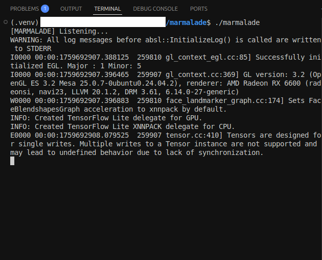
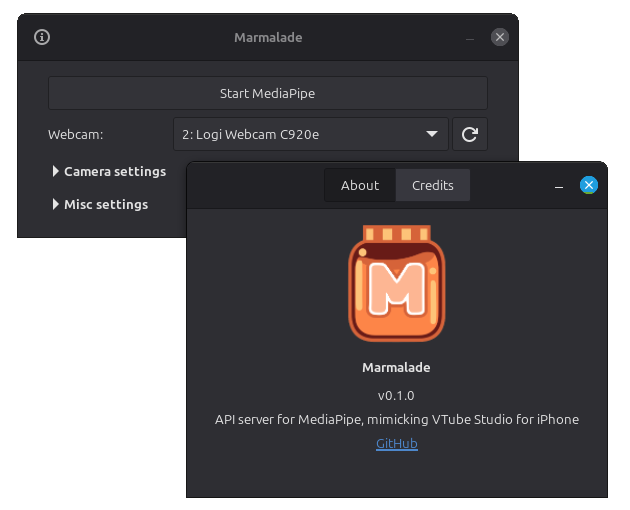

# Marmalade

[](https://github.com/ranawaysuccessfully/marmalade/actions) [](https://github.com/RanAwaySuccessfully/marmalade/releases/latest)

Allows VTuber applications running on Linux, such as VBridger and VSeeFace, to use MediaPipe externally.

| Command-line | GTK 4 (GUI) |
| ---- | ---- |
|  |  |

Also available under GTK 3 (GUI).

## Installing

1. Download the [latest release](https://github.com/RanAwaySuccessfully/marmalade/releases/latest) of Marmalade.
2. Download the latest [`face_landmarker.task`](https://developers.google.com/edge/mediapipe/solutions/vision/face_landmarker) file from Google's MediaPipe page and place it anywhere in the main folder, or create a folder for it if you wish.
3. *Optional:* If you plan on using hand and/or pose tracking, then also download [`hand_landmarker.task`](https://developers.google.com/edge/mediapipe/solutions/vision/hand_landmarker) and [`pose_landmarker_lite.task`](https://developers.google.com/edge/mediapipe/solutions/vision/pose_landmarker) (if you wish, you may alternatively use the full or heavy versions instead).
4. If using any of the GUI versions, you'll also need to have the following installed, although they are probably already installed by default:
    - `libgtk-3`¹ or `gtk3`¹ (>=3.24, only if using GTK 3)
    - `libgtk-4`¹ or `gtk4`¹ (>=4.8, only if using GTK 4)
    - `libv4l`¹
    - `xdg-utils`
    - `pciutils`
5. *Optional:* Install `ffmpeg`¹ (>=4.3). It's likely already installed. See the section "FFmpeg requirement" for more details.

<sub>¹ May be suffixed by another version number depending on your Linux distribution, for example: `libgtk-3-0t64`, `libgtk-4-1`, `libv4l-0`.</sub>

And you're done. You can just run the program at any time, and it should take care of the rest for you.

### FFmpeg requirement

FFmpeg is only required if the video format your webcam uses cannot be converted using `v4lconvert` (`H264` is a good example). If this is the case for you, then you should download the plugin that corresponds to the FFmpeg verison that's installed on your system (other versions of the plugin will not be used). You can check the version of FFmpeg that's installed as follows:

```sh
ffmpeg -version | grep ffmpeg
```

The plugins are available on the releases page alongside each Marmalade release. For a list of formats that need this plugin, check the [fourcc.json](/fourcc.json) file.

### First-time setup

- If using a GUI version, and it notices its icon is not installed, it will install a local copy to distinguish it between just a random executable. If you wish to uninstall the icon, run the command-line version of Marmalade like so: `./marmalade -u`.

## Connecting

Unless you have a very specific use case, **do not change the default port numbers** on either Marmalade or the apps you want to connect to it. The defaults *should* work just fine.

If you're running Marmalade on the same PC as the program you want to connect to, then you can use the IP address `127.0.0.1`, which is the loopback IP (always points to your own PC).

If you're running it on another machine over LAN, you'll need to figure out its IP address and to make sure it is reachable via UDP port that Marmalade is configured to use (see "Config file" section below).

If you need more specific instructions, see [this document](/docs/connecting.md).

### Supported connections

You can choose to connect apps to Marmalade in a few different ways, as long as the app supports the same protocols as Marmalade.

**VBridger**, **VNyan** and **VSeeFace** all support both **VTS 3rd Party API** and **VMC Protocol**.

**Warudo** only supports **VMC Protocol**.

<!-- **VRChat** only supports **VRChat OSC**. -->

<!-- Connecting directly to **VTube Studio** without using any of the apps above requires using the **VTS Plugin** option. -->

The **VTS 3rd Party API** protocol only supports face tracking.

## Resource usage

The numbers below were taken with all tracking types enabled (face, hands and pose). Enabling only face tracking lowers CPU/GPU usage by around 60% and lowers RAM/VRAM usage by around 25%.

Here's an example of it running on a laptop at 1280x720@30FPS using MJPG.

| Component | Usage (CPU mode) | Usage (GPU mode) | Model |
| ---- | ---- | ---- | -------- |
| CPU | 25% | 7% | Intel Core i3-7020U @ 2.30GHz |
| GPU | 0% | 20% | Kaby Lake-U GT2 (HD Graphics 620) |
| RAM | 515MB | 565MB | - |
| VRAM | 30MB | 140MB | - |

And here's an example of it running on a PC at 1920x1080@30FPS, also using MJPG. Higher resolutions (or frame rates) use more resources.

| Component | Usage (CPU mode) | Usage (GPU mode) | Model |
| ---- | ---- | ---- | -------- |
| CPU | 6% | 4% | AMD Ryzen 5700X3D |
| GPU | 0% | 23% | AMD Radeon RX 6600 |
| RAM | 745MB | 844MB | - |
| VRAM | 50MB | 130MB | - |

## Config file

**If using a GUI version, you do not need to worry about this file** unless it becomes corrupted somehow, as the UI allows you to edit it seamlessly. If using the command line version, you'll need to edit it manually to use the settings that you want. It is located right beside the app's executable as `config.json`.

Here's what each field in this file is responsible for:

```jsonc
{
    "camera": 0, // camera ID (index). starts at 0 and goes up from there
    "width": 1920, // camera horizontal resolution (number of pixels)
    "height": 1080, // camera vertical resolution (number of pixels)
    "fps": 30, // camera frames per second (frame rate)
    "format": "MJPG", // camera format used to capture video. these IDs are defined by the Video4Linux2 API (V4L2)
    "model_face": "tasks/face_landmarker.task", // filepath of the face tracking model
    "model_hand": "tasks/hand_landmarker.task", // filepath of the hand tracking model
    "model_pose": "tasks/pose_landmarker.task", // filepath of the pose tracking model
    "hw_accel": {
        "delegate_mp": 0, // which device should be used by MediaPipe. 0 = CPU, 1 = GPU, 2 = Google's NPUs
        "decode": false, // use GPU video decoding
        "prime_id": "" // PCIe bus (slot/address) of the GPU that should be used by MediaPipe.³ can be empty, in which case the default one will be used
    },
    "vts_api": {
        "enabled": true, // enable or disable the VTS 3rd-party API
        "port": 21412 // the UDP port that Marmalade will be listening to. if set to 0, the default one will be used.
    },
    "vts_plugin": {
        "enabled": false, // VTS Plugin - EXPERIMENTAL
        "use_face": false,
        "use_hand": false,
        "use_pose": false,
        "port": 0,
        "token": ""
    },
    "vmc_api": {
        "enabled": false, // enable or disable the VMC Protocol
        "use_face": true, // use face-tracking for this protocol
        "use_hand": true, // use hand-tracking for this protocol
        "use_pose": true, // use pose-tracking for this protocol
        "port": 39539 // the UDP port that Marmalade will be sending data to. if set to 0, the default one will be used.
    },
    "vrc_osc": {
        "enabled": false, // VRChat OSC - EXPERIMENTAL
        "use_face": false,
        "use_hand": false,
        "use_pose": false,
        "port": 0
    }
}
```

<sub>³ This is similar to the `DRI_PRIME` environment variable, and any valid value for it should also work for this field, with the main caveat that Prime usually uses underscores `_` for separators but this variable is saved using colons `:` and dots `.`, for example `pci-0000_0c_00_0` vs. `pci-0000:0c:00.0`. Also, the Marmalade GUIs only expects PCIe bus IDs and may glitch if you use other values.</sub>

## Building, Testing, Debugging

If you want to compile, change or debug Marmalade, see [this document](/docs/build.md).

## License and Credits

Licensed under the [MIT License](LICENSE).

This project uses [ffmpeg](https://www.ffmpeg.org/), [OpenCV](https://github.com/opencv/opencv) and [MediaPipe](https://github.com/google-ai-edge/mediapipe).

This project uses [gotk4](https://github.com/diamondburned/gotk4), which provides [GTK4](https://docs.gtk.org/gtk4/) and [GTK3](https://docs.gtk.org/gtk3/) language bindings for Go. This project does **not** use libadwaita as it's meant to integrate well with many common desktop environments.

We use the following Go libraries: [go4vl](https://github.com/vladimirvivien/go4vl), [go3d](https://github.com/ungerik/go3d), [go-osc](https://github.com/hypebeast/go-osc) and [websocket](https://github.com/coder/websocket).

This project used to have Python code that was modified from [lilacGalaxy's VTS Plugin](https://github.com/lilac-galaxy/lilacs-mediapipe-forward-vts-plugin).

Somewhat inspired by [Facetracker](https://codeberg.org/ZRayEntertainment/Facetracker) which uses OpenSeeFace instead.

Many thanks to Kylo-Neko's [Linux Guide to Vtubing](https://codeberg.org/KyloNeko/Linux-Guide-to-Vtubing) which is what kickstarted my adventuring into seeing if/how I can make this work.

### MediaPipe Tasks APIs Telemetry

Since v0.10.35, the MediaPipe Tasks APIs "send metrics about the performance and utilization of the APIs in your app to Google", however, Marmalade as of v0.5.0 specifically uses a compiled shared-library version of the C API which (we believe) does not contain this telemetry. In either case, they mention that "processing of the input data (e.g. images, video, text) takes place on device, and MediaPipe does not send that input data to Google servers".